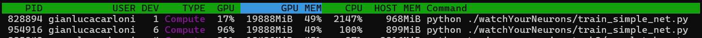

# NVIDIA DGX-A100 UTILITY REPO
This tiny repo contains some useful scripts and bash commands to leverage the full potential of the NVIDIA DGX-A100 infrastructure, such as utilizing Docker and automatically deciding the best GPU node(s) to use when running a new job.

## Rationale
The Institute of Information Science and Technologies (ISTI) of the National Research Council of Italy, in Pisa, has been equipped with a new data center infrastructure: NVIDIA DGX A100. It is a universal system for all AI workloads, offering unprecedented compute density, performance, and flexibility in the world’s first 5 petaFLOPS AI system.

Importantly, this infrastructure features 8x NVIDIA A100 40GB Tensor Core GPUs, thus exposing a total GPU memory of 320GB! I will not go in further details here so, please, refer to [official documentation](https://resources.nvidia.com/en-us-dgx-systems/nvidia-dgx-a100-system-40gb-datasheet-web-us).

## Why using Docker

As an Institute policy, it has been strongly recommended to use [Docker](https://www.docker.com/) to create the environment with the necessary software and launch processes.
When launching a process via `docker run`, the `--cpus` option is strongly recommended to avoid incorrectly occupying the entirety of CPUs. A heuristic for specifying the number of cpus to use is to choose a value between `8*nGPUs` and `24*nGPUs` where `nGPUs` indicates the number of GPUs required.

With this configuration, any changes made outside the current folder will not be retained when closing the container. If the environment needs to be changed (install/remove packages or software, etc.), changing the Dockerfile and re-running the image creation is suggested. This workflow has the advantage of making the creation of the development/launch environment more easily reproducible and robust to accidents (if the docker image I was using is mistakenly deleted, I just rebuild it with a docker build from the Dockerfile).

## docker run

When you have to launch a process (container) that uses possibly mupliple GPUs, it is helpful to automatically detect which of the available GPU nodes are preferable. This is usually associated with their 

In [docker_run_distributed.sh](https://github.com/gianlucarloni/dgx-a100_utils/blob/3de9854563b738161e782f88ab4cae4c14952044/docker_run_distributed.sh) I give an example of a script that, before launching a multi-GPU container, checks which nodes to select and assigns them to the docker run command. That bash (.sh) script starts by taking user's input from stdin (prompt via keyboard) to allocate the right number of GPUs (`NUM_GPUS=$(($1))`). For instance, if the user wants to utilize 2 GPUs will pass `2` as first (an only) argument of the bash script. Then, it computes an appropriate number of CPUs based on the requested `NUM_GPUS` and removes all previous (old) temporary text files.

After that, the script leverages the `nvidia-smi` functionality. That is a command that provides monitoring and management capabilities for each of NVIDIA's Tesla, Quadro, GRID and GeForce GPU device from Fermi and higher architecture families. It is installed along with the CUDA toolkit and provides you with meaningful insights, such as: the ID and name of each GPU device, its working temperature, memory usage, percentage of GPU access, and so on. Based on such information, we can decide which is the better GPU for us to use.

Specifically, by running `nvidia-smi --query-gpu=memory.used,utilization.gpu --format=csv` we query the output of nvidia-smi to give us the amount of memory usage and percentage utilization of each GPU. In the script, the lines of code that go from this query to the `echo "The top $NUM_GPUS free GPUs are: $arrVar"` line, automatically compute a score of goodness to each GPU node based on their memory usage and percentage utilization, sort them in ascending numerical order, and assign the top `NUM_GPUS` free GPUs to a variable `arrVar`. After that, comes the `docker run` command, with certain flags (arguments) to set specific values. It is in this step that you have to specify the `--gpus` argument to the value of `arrVar` (note: here, a `arrVar3` is used instead, which is a custom string variable based on `arrVar` to properly match the Docker synthax).

And you're good to go!

## Optimize 'num_workers' in PyTorch DataLoaders

To avoid blocking computation code with data loading, PyTorch (`torch`) provides an easy switch to perform multi-process data loading by simply setting the argument `num_workers` to a positive integer. This is especialyl useful when workinkg with large image dataset, such as [chest x-ray images for DL architectures](https://github.com/gianlucarloni/causal_medimg). Setting the argument `num_workers` as a positive integer will turn on multi-process data loading with the specified number of loader worker processes.

This is done within the `DataLoader` class definition:
`torch.utils.data.DataLoader(dataset, batch_size=1, shuffle=None, sampler=None, batch_sampler=None, num_workers=0, collate_fn=None, pin_memory=False, drop_last=False, timeout=0, worker_init_fn=None, multiprocessing_context=None, generator=None, *, prefetch_factor=None, persistent_workers=False, pin_memory_device='')`

and, below, I show how increasing the number of workers actually improves the speed of loading and processing, thus ultimately of training, during deep learning experiments.

### Compare default ('num_workers=0') and set 'num_workers=8'

The figure below depicts the output of the `nvtop` command from a terminal within the NVIDIA DGX server, while executing the same python script with two different `num_workers` values:

The first row represents the case where I ran the script on CUDA device '1' with default settings ('num_workers=0'): you can see that the GPU time-unit utilization is only 17 per cent, while the CPU one is 2147 %. As a result, the processing speed observed with `tqdm` during training was merely of **1.55 s/it** (thus, drastically less than one batch per second!). Observing high CPU usage and low GPU utilization during the training of a PyTorch model can indicate that my script is creating a bottleneck, most probably caused by an inefficient data loading. Indeed, it needs to spend huge efforts with loading over 110000 images: the CPU might be working hard to load and preprocess the data, while the GPU waits for the data to be ready.

To mitigate that effect, I optimized the data loading process by using a sufficient number of worker threads in my DataLoader. As you can see from the second row in the figure above, the GPU utilization increased to 96 % and the cPU got back to usual regime values of 100%. As a result, the processing speed observed with `tqdm` during training skyrocketed to **4.15 it/s** (thus, nicely more than four batches per second!).
